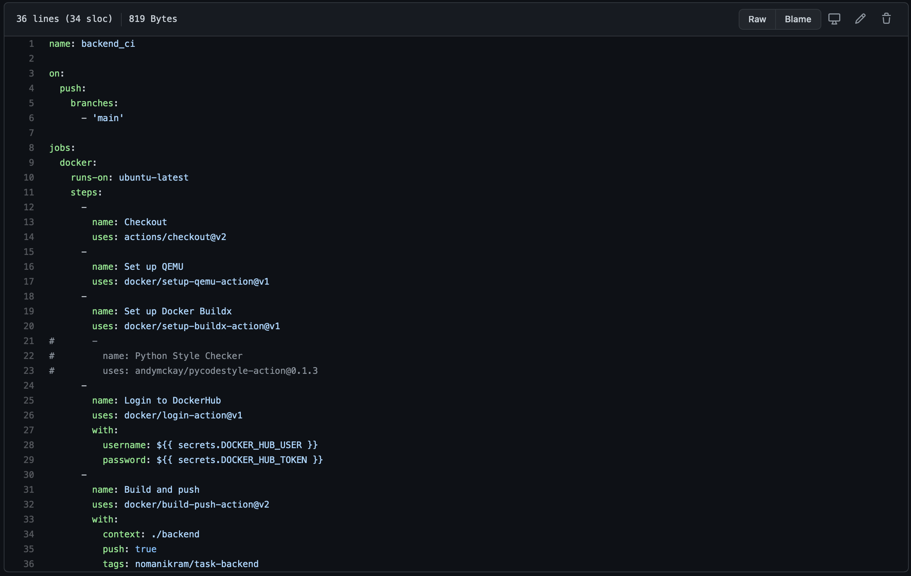

# Assignment_task

## To create backend for registering and authentication
* In order to make Restful APIs for the Registering / Authenticating user, I have used extension of `Flask` library called `Flask-Restful` and `sqlalchemy` for ORM. 
* In this project, project structure is organized pretty well with `Models`, `Resources` and `Services` placed in separated python packages. 
* I have made two APIs endpoints as required in the task i.e. `/user/register` and `/user/login`
* **/user/register** endpoint takes two input `username` & `password`. And it encrypts password and then stores it in the database. Since password should not be stored in the database in the unencrypted form.
* **/user/login** endpoint takes two input `username` & `password`. And it takes the encypted password from the database for the user if present then decrypt it and compare with the one user provided. Incase it matches so it displays message showing `VALID USER` 

## Unit Test for the backend service
* Unit Tests are important to prove the proper functionality of the application.
  Since in the present scenerio where **authentication/registering** was required to  be checked. I wrote some unittests.
* These testcases include checking against if new users are adding into the table, for wrong credentials for authentication, authentication real user.
* You can run these testcases for backend service, by first moving to the `backend` directory.
* Before running application, by starting the **backend service** along with **mysql docker container**
* After that run cmd `python3 -m unittest discover -s ./ -p '*_test.py'` to run these testcase.

## Use of mysql docker container as a database
I have used mysql image to run container on host to communicate with the backend services. Command that were required to **configure mysql container** are as follow.

1. Run Container by 
`docker run  --name mysql_container --rm -d  -p 3306:3306 -e MYSQL_ROOT_PASSWORD=SECRET mysql` 
2. Enter into interactive mode by `docker exec -it mysql_container bash`
3. Type `mysql -u root -p` and Press Enter. You will be prompt for `PASSWORD`. Enter **Password** and press Enter Key.
4. create database task;

 
## Creation front-end for the backend
Front-end was built using Flask. It is a separate flask project, which will be containerized on later stage.

* For demonstrating registering and authentication, I've created a single page with two separate forms i.e. one for authentication and another for registeration.
* These forms have some validation applied i.e. both fields can not be empty, password & confirm password should be same while registering etc
* Both of these forms shows some **indication/response text** on submitting form in message text field situated below individual form.

#### **Registering new user**
 
#### **Message displayed on Registration**

#### **Registration failed when trying to register with same username**

#### **Login with same user registered earlier**

#### **Login failed with invalid credentials**<!---->

> Password fields could be used for getting password, used only textfields for demonstration purpose

## Frontend and backend writing logs to elasticsearch
* In order to work with elasticsearch, I ran a container using command 
 `docker run -p 9200:9200 -p 9300:9300 -e "discovery.type=single-node" docker.elastic.co/elasticsearch/elasticsearch:7.11.2`
* Inside both project i.e. frontend and backend. I installed a package called `elasticsearch`  through pipe. 
* Created index for elasticsearch for both services
* Logs were inserted into index `format:: <service-name>_logs-YYYY-mm-dd` with **id** and **doc** (message/log)
<!--* After getting some logs into elasticsearch, run queury `body = {
    "from":0,
    "size":5,
    "query": {
        "match": {
            "message":"backend"
        }
    }
}`
-->

This statement will help you see the list of result from search.
`print(es.search(index='register_frontend_service_call_logs_logs-2021-03-18'))`. This statement is present in backend project in the file named as `es.py`

Applying some formatting to view the result in properly formatted form.

## Containerize both services
Both of these containers were build and pushed into docker registry mentioned below

1. **Backend Image:** `nomanikram/task-backend`
2. **Frontend Image:** 	`nomanikram/task-frontend`

These images can be pulled from docker using `docker pull` command

## Push the code to the Github Repository
Code is moved into the github repo, which can be accessed by following `https://github.com/iNomanIkram/assignment_task`

## CI pipeline by using Github actions
Continous Integration Pipeline created for building the docker image and push it to docker hub

